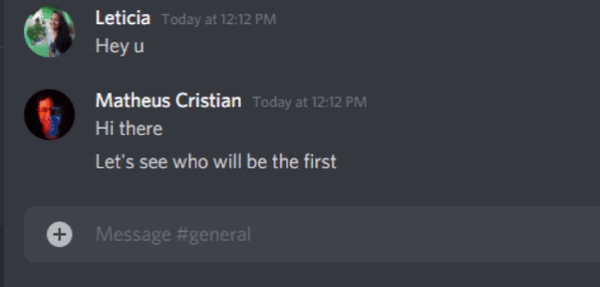

# :robot: Shuffle Mentions Discord Bot
A discord bot to shuffle mentions to create a randomly ordered list.

## :eye: Preview
  
_Special thanks to Leticia and Polly	:smiling_face_with_three_hearts:_

## Starting

1. Create a file named `.env` in source folder;

2. Set the content of this file as:
```env
DISCORD_TOKEN=YOUR_DISCORD_BOT_TOKEN
```

3. Start the project and shuffle everyone :partying_face:

```bash
npm run start
```
